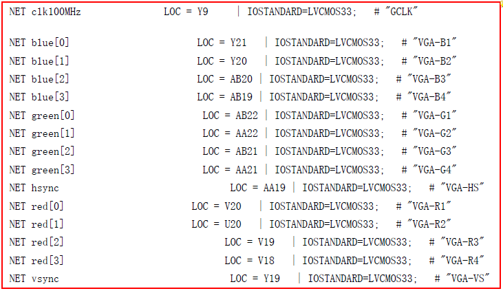
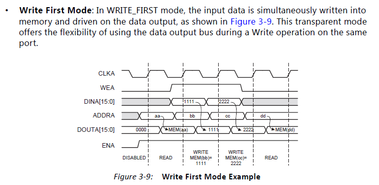

# Zedboard SoPC学习记录
-----
- 2016.6.15
---
将连接HDMI的XPS工程导入ISE，导入方法为：
1. 在ISE界面Design面板中右击工程文件夹，选择`Add Source...`，选择XPS的工程文件`system.xmp`；
2. 在Design面板`Hierarchy`中选中`system.xmp`文件，在下面的`Processes`中选择`Create Schematic Symbol`；
3. 生成成功后选择`Generate Top HDL Source`，就会在Hierarchy窗口中生成`system_top.v`，此时XPS的工程就可以作为模块调用；
4. 选中`system_top.v`可以进行`User Constraints`设置，基本都会自动生成；
5. 接着进行`Synthesize`，`Implement Design`和`Generate Programming File`；
6. 成功执行`Generate Programming File`后会生成`system_top.bit`比特流文件，可作为配置文件之一生成`BOOT.BIN`；
7. 生成`fsbl.elf`：可以在ISE中选中system.xmp在下面的Processes中选择`Export Hardware Design To SDK`，带不带bit流生成均可，打开SDK后的操作和以前一样。

**遇到的问题**：
<br>在`Implement Design`过程中显示Error，<font color = red>vga_flyinglogo_0_GREEN_O_pin[0]等几个引脚没有配置好</font>，是原有xmp工程中引脚约束的问题，打开用户约束设置，按照如图所示对比填写。



除此之外将RGB三个通道 IOSTANDARD 都设置成了 LVCMOS33：
```
IOSTANDARD = LVCMOS33;
```
最终可以正常生成bit文件进行硬件配置。

---
PL读写操作BRAM：
<br>根据数据手册datasheet，BRAM设定的位宽与读写地址有关。当设定的位宽为`32bit`时，其存储结构如下表：
<table>
<tr><td>Address</td><td>Data</td></tr>
<tr><td>0x0000</td><td>0x1111</td></tr>
<tr><td>0x0004</td><td>0x2222</td></tr>
<tr><td>0x0008</td><td>0x3333</td></tr>
</table>
因为`32bit`即4个字节，每一个地址下数据可存储4个字节，相应的下一位地址就增长4个字节（地址的单位也是字节）。

读写时序如图所示：（仅仅为**write first**模式下，其余模式参照**DataSheet**）



发现的问题：以表格中为例，如果访问地址0x0006，虽然输出一定是32bit数据，但不会是0x2233，而是0x2222，即访问的任意地址时访问的是其所在位宽中所存储的数据，不能跨位宽输出。

PS：Xilinx官方文档中以pg开头的都是DataSheet；在ISE中添加IP核时也可以点击相应的DataSheet按钮进行查看。

-----
2016.6.16
---
