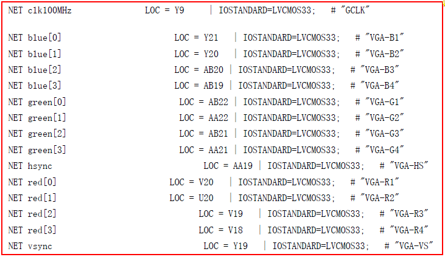
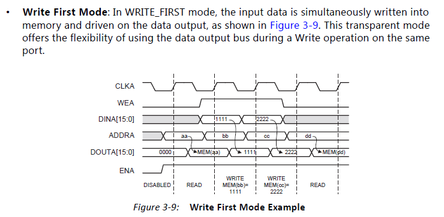
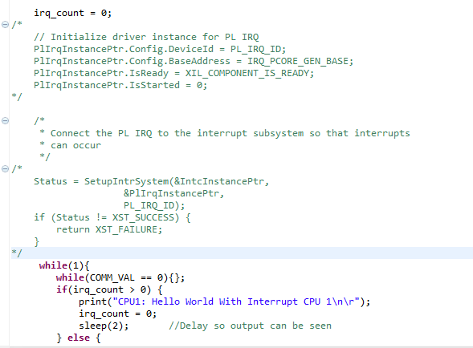

# Zedboard SoPC学习记录
-----
- 2016.6.21
---
研究在C语言中进行内存写入数据时的**`Cache`**机制：

1. 关键字`volatile`：跳过缓存机制直接从DDR中读取数据；

---

---
- 2016.6.20
---
和刘文超师兄开会，确定一下几点：

1. 要对PS和PL之间的高速数据传输进行探索，如比较申师姐使用的**CDMA**和可能会以后使用的**DMA**；<br>
2. Verilog语言学习一个星期，并且通过小例子，融合成一个小型系统，进行数据流设计；
3. 驱动编写要纳入整体设计流程之中，学习相应的驱动设计方法；
4. 师兄的PPT还是要认真研究一下。

---

---
- 2016.6.16
---
解决XPS在win10系统下打开文件夹就闪退的问题；

1. 添加环境变量：在**系统变量**中新建两个环境变量，如下：<br>
 
 ```
 变量名：XILINX      变量值：D:\Xilinx\14.7\ISE_DS\ISE\  （即安装ISE的路径）
 变量名：XILINX_EDK  变量值：D:\Xilinx\14.7\ISE_DS\EDK\  （即安装EDK的路径）
 ```
2. 使用路径`D:\Xilinx\14.7\ISE_DS\EDK\bin\nt\xps.exe`下打开即可，这是32位系统使用的XPS。

---

---
- 2016.6.15
---
将连接HDMI的XPS工程导入ISE，导入方法为：

1. 在ISE界面Design面板中右击工程文件夹，选择`Add Source...`，选择XPS的工程文件`system.xmp`；<br>
2. 在Design面板`Hierarchy`中选中`system.xmp`文件，在下面的`Processes`中选择`Create Schematic Symbol`；<br>
3. 生成成功后选择`Generate Top HDL Source`，就会在Hierarchy窗口中生成`system_top.v`，此时XPS的工程就可以作为模块调用；
4. 选中`system_top.v`可以进行`User Constraints`设置，基本都会自动生成；
5. 接着进行`Synthesize`，`Implement Design`和`Generate Programming File`；
6. 成功执行`Generate Programming File`后会生成`system_top.bit`比特流文件，可作为配置文件之一生成`BOOT.BIN`；
7. 生成`fsbl.elf`：可以在ISE中选中system.xmp在下面的Processes中选择`Export Hardware Design To SDK`，带不带bit流生成均可，打开SDK后的操作和以前一样。

**遇到的问题**：
- 错误方式：在`Implement Design`过程中显示Error，<font color = red>vga_flyinglogo_0_GREEN_O_pin[0]等几个引脚没有配置好</font>，是原有xmp工程中引脚约束的问题；
- 可行的解决方案：
<br>打开用户约束设置，按照如图所示对比填写。

 

 除此之外将RGB三个通道 IOSTANDARD 都设置成了 LVCMOS33：
 ```
 IOSTANDARD = LVCMOS33;
 ```
 最终可以正常生成bit文件进行硬件配置。

---
PL读写操作BRAM：
- 根据数据手册datasheet，BRAM设定的位宽与读写地址有关。当设定的位宽为`32bit`时，其存储结构如下表：
 <table>
 <tr><td>Address</td><td>Data</td></tr>
 <tr><td>0x0000</td><td>0x1111</td></tr>
 <tr><td>0x0004</td><td>0x2222</td></tr>
 <tr><td>0x0008</td><td>0x3333</td></tr>
 </table>
 因为`32bit`即4个字节，每一个地址下数据可存储4个字节，相应的下一位地址就增长4个字节（地址的单位也是字节）。

- 读写时序如图所示：（仅仅为**write first**模式下，其余模式参照**DataSheet**）

 

- **发现的问题**：
<br>以表格中为例，如果访问地址0x0006，虽然输出一定是32bit数据，但不会是0x2233，而是0x2222，即访问的任意地址时访问的是其所在位宽中所存储的数据，不能<font color = "red">**跨位宽输出**</font>。

><font color = "yellow">**PS**：Xilinx官方文档中以pg开头的都是DataSheet；在ISE中添加IP核时也可以点击相应的DataSheet按钮进行查看。</font>

---

---
- 2016.4-2016.5
---
使用Zedboard实现双核异步AMP模式的教程时，生成`BOOT.BIN`中在SDK生成`app_cpu1.elf`文件中，建立app_cpu1工程，可能出现错误：
- 错误方式：`"XPAR_IRQ_GEN_0_BASEADDR" undeclared Error 1`

- 可行的解决方案：
<br>这是由于程序app_cpu1.c中存在中断程序，而之前的操作缺少相应的硬件设备设置，所以出现未定义的参数；
可行的解决方案：将和中断相关的程序注释掉，即：`//Initialize driver instance for PL IRQ`部分和`Status`的使用部分，如图所示：

 

---
使用Zedboard实现双核异步AMP模式的教程时，生成`BOOT.BIN`中在SDK生成`amp_fsbl.elf`文件中，针对ISE14.7很可能在创建完工程后编译出现错误的情况：
- 错误方式：`cannot find -lrsa  Error 1`

- 可行的解决方案：<br>此处OS Platform选择**`standalone_amp`**而不是standalone在第一次编译仍然出现 cannot find -lrsa  Error 1之后，右键工程文件夹，（即amp_fsbl文件夹）在菜单中选择`C/C++ Build Settings`这一选项，点击`Tool Settings`选项卡中`ARM gcc linker`下的`Libraries`；<br>将其右侧窗口中的两个部分`Libraries(-l)`和`Library search path(-L)`中的内容全部删除，点击OK重新编译后应该可以通过，并产生相应的amp_fsbl.elf文件。

---
Ubuntu14.04下安装ISE14.7步骤：

1. （实验室已有license，所以可跳过1）登录[china.xilinx.com](http://china.xilinx.com)，注册帐号（下载和获取证书需要登录，注册时有些选项需要用英文填写，确保所填邮箱正确）；<br>
2. 下载**`Xilinx_ISE_DS_14.7_1015.tar`**（8.4GB）（Window和Linux通用版，注意后缀.tar）；
3. 进入安装包所在文件夹，解压：

 ```
 $cd /media/New/download（此命令根据自己的下载路径）
 $sudo tar xvf Xilinx_ISE_DS_14.7_1015.tar
 ```
4. 安装包被解压到当前目录，运行安装程序：

 ```
 $cd Xilinx_ISE_DS_14.7_1015
 $sudo ./xsetup
 ```
 安装程序是图形界面的，跟windows的安装程序差不多，根据提示进行就可以，会有两次选择，第一次选**System Edition**，第二次的选择**全打勾**，安装路径一般选择装在/opt下，配置好以后开始安装。安装过程中很有可能会提示驱动安装失败，先不管；还会提示证书，这个也不管，关掉后会继续安装，直到结束。
5. 安装结束后，进入目录，先运行一个shell文件，配置环境变量，然后运行ISE：
 
 ```
 $cd /opt/Xilinx/13.2/ISE_DS/
 $source settings32.sh
 $ise（注意是小写的ise才能启动）
 ```

><font color = "red">**PS**</font>：以后启动ISE的操作都要按照步骤5的流程，进入目录，运行shell文件，再运行ISE。可以将这几条命令存在脚本文件中，通过`source shell.sh`调用运行多条命令。（在运行完`settings32.sh`脚本后，输入`xps`启动XPS，输入`xsdk`启动SDK）。

---
Ubuntu14.04自带的ibus输入法很可能存在双拼的Bug：

- 即无法正确的对输入的拼音进行断句，造成输入`nihao`时输出`你哈o`这样的问题。
- 解决方法如下：
<br>在终端输入命令：`ibus-deamon –drx`，再进行重启，就可以了。

---
初次使用Ubuntu发现无法切换Root权限状态，可以按照如下步骤做：

1. 先设置root的密码：`sudo passwd root`；<br>
2. 在控制台直接输入：`su root` 并输入密码，就可以获得root权限；
3. 如果想在文件管理器中使用root，只要在控制台输入：`sudo nautilus`。

---

-----
# 记录文档书写规范：
---
- 年.月.日（采用压栈顺序记录）
---
主要问题（概述）：
- 问题形式（错误类型）；
- 可行的解决方案；

---
操作步骤：（同一日期不同记录用`---`进行隔开)

1. 第一步；<br>
2. 第二步；

>PS：注意格式的对齐、以及适当<font color = "red">标红</font>，记录重点。